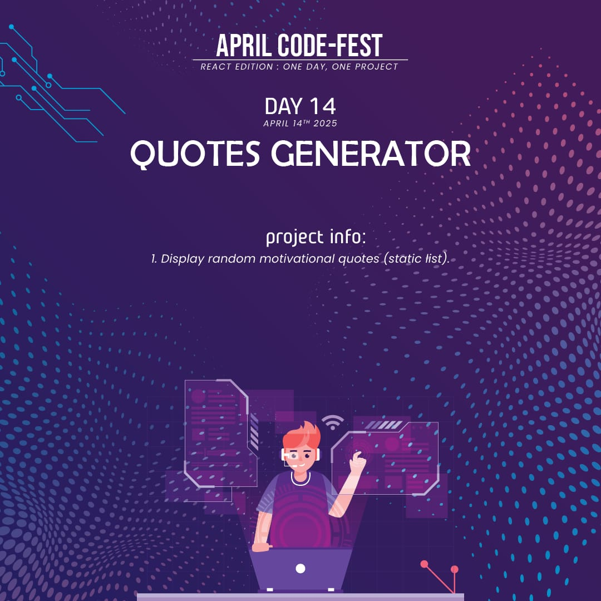
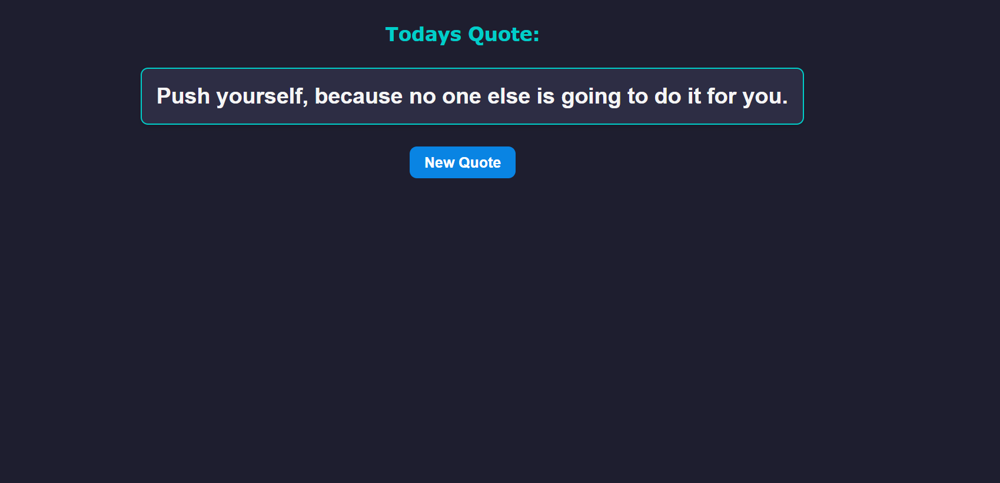

# 💬 Quotes Generator

A simple **React** application that displays a randomly selected quote with the click of a button. Perfect for daily motivation, tech inspiration, and celebrating the spirit of parenthood and persistence.

---

## 📌 Features
- ✅ **Random Quote Generator**: Shows a new quote with each click.
- ✅ **Diverse Quote Categories**: Includes tech quotes, motivational messages, and quotes about parents.
- ✅ **Clean UI**: Styled with external CSS for modern, responsive layout.
- ✅ **Beginner Friendly**: Great project to practice React hooks like `useState`.

---

## 🛠️ Technologies Used
- ⚛️ **React** (`useState` for managing the current quote)
- 🎨 **CSS** (`Quotes.css` for custom styling)
- 📄 **HTML / JSX** (structure inside React components)

---

## 🚀 Live Demo
To see it in action, clone the repository and follow the setup instructions below.

1. **Clone the repository:**

   ```bash
   git clone https://github.com/Eshhaa11/quotes-generator
   
   
2. **Navigate to the project directory:**

   cd  quotes-generator

3. **Install dependencies:**

   npm install

4. **Start the development server:**

   npm start

5. **Open your browser and visit:**

   http://localhost:3000

---

 ## 🎨 Screenshots:
 

 ---

 ## 🤝 Contributing:
 Want to improve this project? Fork the repository, create a feature branch, and open a pull request. All contributions are welcome! 🚀✨
 
 ---

 🎉 Happy Coding!